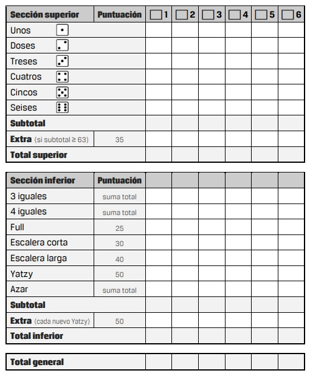

# Yatzy

Yatzy es un juego de mesa desarollado por Antonio Maroto como alumno del Instituto Francesc de Borja Moll para la asignatura de Programación.

---

## Índice

 - [¿Qué es Yatzy?](#¿qué-es-yatzy)

 - [¿Cómo jugar a Yatzy?](#¿cómo-jugar-a-yatzy)

 - Desarollo

---

## ¿Qué es Yatzy?

Yatzy es un juego de dados cuyo objetivo es obtener la mayor puntuación posible tras sumar las 13 combinaciones disponibles en la tabla de puntuaciones. Puede jugar cualquier número de jugadores, incluso se puede jugar en solitario

---

## ¿Cómo jugar a Yatzy?

Yatzy es un juego simple de dados. Cada jugador lanza 5 dados de 6 caras cada uno. Puedes volver a lanzar los dados hasta un máximo de tres veces (incluyendo el lanzamiento original)

Según la combinación de números que obtiene un jugador puntúa una cantidad u otra.

Las puntuaciones se anotan en la tabla de puntuaciones

---

### Tabla de puntuaciones

Aquí tenemos un ejemplo de una tabla de puntuaciones para jugar a Yatzy.

Tenemos dos secciones donde podemos puntuar:

- Sección superior
- Sección inferior

### Sección superior

En la sección superior podemos anotar la suma de todos los números iguales que hemos obtenido.

Por ejemplo, supongamos que hemos obtenido estos dados:

    1,1,3,3,5

Podríamos anotar una opción de la siguientes:

    2 Puntos en "Unos"

    6 Puntos en "Treses"

    5 Puntos en "Cincos"

Si elegimos puntuar los 6 puntos en "Treses" ya no podemos volver a anotar en "Treses" hasta el final de la partida.

Podemos obtener puntuación extra (35 puntos) si la suma de todas las casillas de la sección superior es igual o superior a 63 puntos.

---

### Sección inferior

Así como la sección superior se rige por una misma norma, la suma de todos los números iguales, la sección inferior mayoritariamente es diferente, veámoslo en detalle:

#### 3 iguales

Es igual que en la sección superior, se produce cuando obtenemos tres dados iguales.

La puntuación es la suma de los tres dados iguales.

Por ejemplo:

    3,3,3,4,5

La puntuación en este caso sería de 9 puntos.

---

#### 4 iguales

Es igual que en la sección superior, se produce cuando obtenemos cuatro dados iguales.

La puntuación es la suma de los cuatro dados iguales.

Por ejemplo:

    2,2,2,2,1

La puntuación en este caso sería de 8 puntos.

---

#### Full / Full House:

Se produce cuando obtenemos la combinación de dos y tres dados iguales.

La puntuación con Full House es de 25 puntos.

Por ejemplo:

    3,3,4,4,4

---

#### Escalera corta:

Se produce cuando obtenemos una secuencia de cuatro números consecutivos.

La puntuación de la escalera corta es de 30 puntos.

Por ejemplo:

    1,2,3,4,4

---

#### Escalera larga:

Se produce cuando obtenemos una secuencia de cinco números consecutivos.

La puntuación de la escalera larga es de 40 puntos.

Por ejemplo:

    1,2,3,4,5

---

#### Yatzy:

 Se produce cuando obtenemos cinco números iguales.

 La puntuación de Yatzy es de 50 puntos.

Por ejemplo:

    1,1,1,1,1

---

#### Azar / Chance:

Se produce siempre, y podemos decidir usarlo cuando queramos, sería algo así como un comodín.

La puntuación de Azar / Chance es la suma de los cinco dados.

Por ejemplo:

    1,1,2,2,3

La puntuación en este caso sería de 9 puntos.

---

#### Extra

Si a lo largo de la partida un jugador consigue hacer más de un Yatzy se le suman 50 puntos.

---

#### Importante

Si durante el transcurso de la partida algún jugador obtiene una combinación de 5 dados que no le aporta nada en ninguna de las secciones, está obligado a puntuar 0 puntos.

Todos los jugadores deben puntuar siempre en todos los turnos.

#### Total general

Es la suma de ambas secciones.

Gana el jugador que obtiene la mayor puntuación

### Ejemplo

Supongamos que el jugador ha conseguido los siguientes dados:

    3,4,5,5,2

El jugador decide guardar los dados (-,-,5,5,-) y vuelve a lanzar los tres dados restantes (3,4,-,-,2):

    5,2,5,5,1

El jugador decide guardar los dados en los que ha obtenido un cinco (5,-,5,5,-) y vuelve a lanzar los dos dados restantes (-,2,-,-,1):

    5,3,5,5,3

Una vez tenemos los dados finales podemos observar que hemos obtenido una de la siguientes opciones Full House, 3 iguales, Chance / Azar, Treses o Cincos. 

Ahora ya es decisión del jugador elegir donde puntuar.

## Funcionamiento del programa

**Inicio del juego**

    - Usuario introduce su nombre.
    - Se crea un diccionario en el que se almacena la tabla de puntuaciones.

**Primer lanzamiento de los dados**

    - Se crea una lista vacía llamada diceRollOne[] en la que se van a almacenar los dados de la primera tirada.
    - Se añaden números aleatorios mediante la biblioteca random.
    - Dicha lista se muestra al usuario mediante la terminal.

**Guardar dados**

    - Se le pregunta al usario si quiere mantener alguno de los dados de la primera tirada.
    - Si el usuario quiere almacenar los dados indica cuales escribiendolo en la terminal.
    - Esos dados se almacenan en una variable llamada Keep.
    - Los datos que introduce el usuario mediante consola son un String.
    - Transformo esos Strings en Integers y los añado a una nueva lista vacia, la lista del segundo lanzamiento llamada diceRollTwo[].

**Segunda lanzamiento**

    - La lista diceRollTwo contiene x números que ha guardado el usuario de la primera tirada.
    - Se le añade a la lista del segundo lanzamiento 5 - x números para tener todos los dados de la tirada.
    - Se muestra el resultado de los 5 dados al usuario mediante la terminal.

**Guardra dados**

    - Se le pregunta al usario si quiere mantener alguno de los dados de la segunda tirada.
    - Si el usuario quiere almacenar los dados indica cuales escribiendolo en la terminal.
    - Esos dados se almacenan en una variable llamada Keep.
    - Los datos que introduce el usuario mediante consola son un String.
    - Transformo esos Strings en Integers y los añado a una nueva lista vacia, la lista del tercer lanzamiento llamada diceRollThree[].

**Tercer lanzamiento**

    - La lista diceRollThree contiene x números que ha guardado el usuario de la primera segunda.
    - Se le añade a la lista del tercer lanzamiento 5 - x números para tener todos los dados de la tirada.
    - Como es la última tirada no se pueden almacenar más dados, así que simplemente se muestran por terminal los cinco números.

**Puntuar**

    - Se le pregunta al usuario en que sección de la tabla quiere puntuar el usuario: Top (Superior) o Bot (Inferior).
    - Cuando ha elegido la sección tiene que seleccionar en que recuadro de la sección: Ones, Twos, Threes, Fours, Fives o Sixes.
    - Mediante una fución se detecta la puntuación que obtiene el usuario al seleccionar cada recuadro.
    - Se actualiza el diccionario con la puntuación que he determinado la función.
    - Se imprime por pantalla el diccionario y la puntuación de cada sección y la puntuación total acumulada.

**Fin de la partida**

    - Se muestra por pantalla el nombre del usuario y su puntuación total de la partida.

